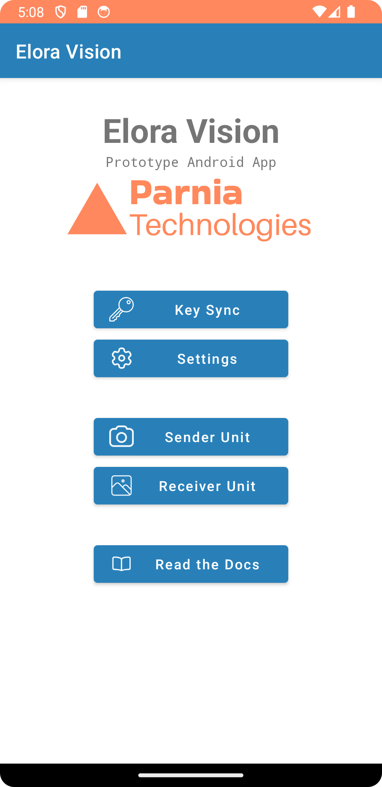

Apps
====

.. _installphoneapp:
How to install the Elora Vision android app on your phone
---------------------------------------------------------

`link to download the android app <https://github.com/aminjahanpour/elora_vision_android_app/releases/download/released/elora_vision.apk>`_

`Click on this link to download the APK file. <https://github.com/aminjahanpour/elora_vision_android_app/releases/download/released/elora_vision.apk>`_ Then follow the steps to install the app on your phone.
You can safely ignore any warnings that may appear. The app is completely safe, and its source code is publicly available for anyone to verify and evaluate.

Experienced users can also download the source code from `here <https://github.com/aminjahanpour/elora_vision_android_app>`_, build the project in Android Studio, and install it on their phones themselves.

.. note::
    The minimum required Android version is Android 6 (Marshmallow).
    This was intentional, so that older devices can run the app as well.
    According to `apilevels.com <https://apilevels.com/>`_, 97.9% of Android devices meet this requirement.

.. _installdesktopapp:
How to install the Elora Vision desktop app on your computer
------------------------------------------------------------

The desktop app is written in Python, so it runs on any computer with any operating system that can run Python.
The app comes with a graphical user interface, which makes it easy to use.

Here are the steps to set up and run the app on your desktop computer.

Start a terminal in Windows/Ubuntu/Mac and run the following commands:

.. code-block::

    git clone https://github.com/aminjahanpour/elora_vision_desktop.git
    pip install -r requirements.txt
    python main.py

**Notes for Ubuntu Users**

If you get an error complaining that ``tkinter`` is not installed, run the following line of code to install it on your Ubuntu machine.

``sudo apt-get install python3-tk``

You might also get the following error after pressing *Play*:

``serial.serialutil.SerialException: [Errno 13] could not open port /dev/ttyACM0: [Errno 13] Permission denied: '/dev/ttyACM0'``

The port shown in your case may differ from ``ttyACM0``. This problem can be resolved by granting write permission on that port.
To do so, run the command below. Replace ``ttyACM0`` with the port shown in your error message.

``sudo chmod 666 /dev/ttyACM0``