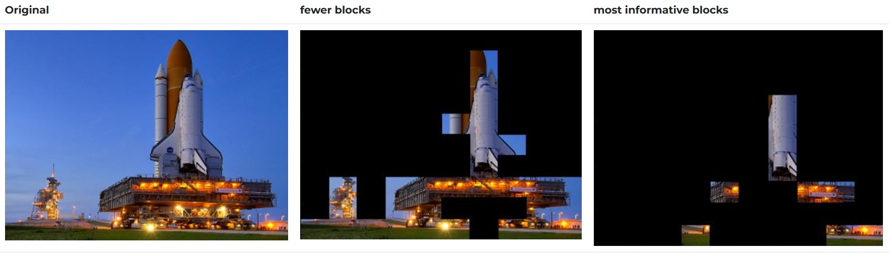
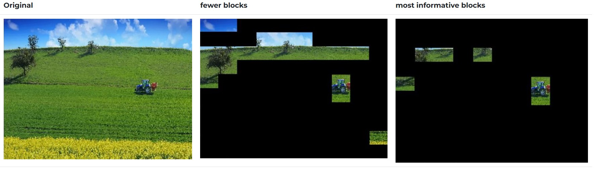
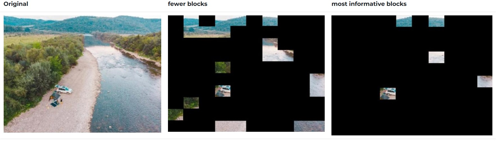

.. _image_processing:
Image Processing
================

We need to keep in mind that LoRa radios, despite their great range, have a very limited throughput.

So to reduce the time lag in between transmitted frames I needed to reduce the image size by whatever mean necessary.

Image compression can only get us so far.
To make the payload even smaller, I came up with an algorithm that cherry-picks important parts of the image and only transmits those.
More precisely, the less informative blocks of an image frame are masking out before transmission.

Here is an overall look to the algorithm:
The image frame in divided into 64 blocks.
Next, image processioning and statistics methods are applied to sort the 64 blocks by how informative they are.
A certain number of the high-ranking blocks are then picked and transmitted. The blocks count is determined by the user in the Settings page of the Elora Vision app.

This algorithm is designed to spot **anomalies** on the frame. I'm good at spotting anomalies. This is what I did for my PhD thesis. Different anomalies, different context however.

Here are some examples of the algorithm output.

Here we can see that the sky has been excluded from the output frame as it does not provide too much of critical information to the viewer :-)

Perhaps the most informative part of this image is the tractor. It is successfully made through the masking process.

In this drone shot the campers and their vehicle are highlighted by the algorithm.

In short, the Elora Project app on the Sender Unit could either transmit the full image frame or only parts of it depending on your choice in the Settings page of the app.

Here is a more detailed explanation of the algorithm workflow.

every image block is analysed from two prospectives:

1) how much unique hue values exist in the block? Histogram analyses is performed to figure this out.

2) how diverse the unique hue values are in the block? Weighted variance is calculated for this.

Once we have these two ranks figured out for each block, we need a logic based on which we can decide which blocks are the most informative ones.
The logic I used here is the one used in multi-objective optimization. Simply plot the ranks as a Pareto-front and perform a dominance check. The blocks that survive are the ones that are not dominated by any other block.
Finally, pick a pre-determined number of the non-dominated blocks to include in the final image frame.

