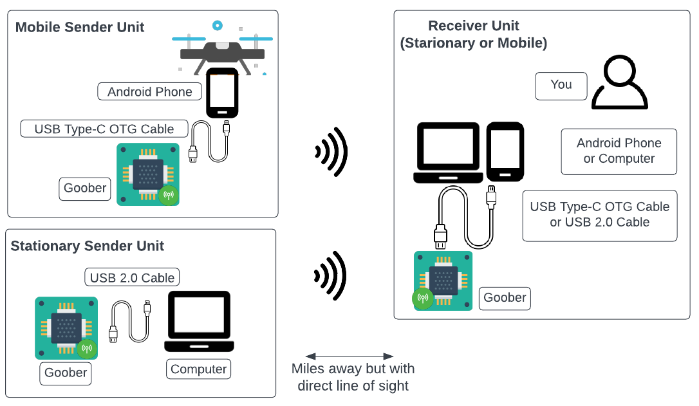

Welcome to Elora Vision Project documentation!
===================================

This project is all about **efficient transmission of encrypted data over long distances** while keeping the costs as low as possible.

The technology enables real-time monitoring, internet protocol over radio, and image sharing in areas where other forms of
communication are inaccessible. It can play a vital role in various fields
such as remote sensing, emergency response, and off-grid exploration, where the secure transmission of visual data can provide
crucial insights and aid in decision-making processes.

All communications made in the network are encrypted. Furthermore, the network design is secure and resistant to malicious interference.
Internet protocol has also been tested on this platform.

When scaled, this technology can play a significant role in helping people who need it.
**That is why I did my best to keep hardware manufacturing costs as low as possible.**
This enables affordability and accessibility of the technology, making it more widely available to a larger population.

This open-source / open-hardware project is built around the cheaper and more modest components available in the market.
All one would need to benefit from this technology are two computers (or android phones), some USB cables and two PCBs.
You can build a PCB by yourself from some basic parts or order `this PCB <https://github.com/aminjahanpour/elora_vision_pcb>`_ to be manufactured and shipped to you by `JLCPCB <https://jlcpcb.com/>`_ or any other PCB manufacturer.

.. note::
    For this particular project, I do not have financial goals. Having eyes in the sky can save lives. It is much more important than money.

    **All the codes and hardware designs are (and will remain to be) open-source.**

    If you need this technology, `my Github repos <https://github.com/aminjahanpour>`_ provide everything that you need to rebuild the technology.
    You will not need a permission from me. Also `here I teach you how to rebuild this technology all by yourself. <https://elora-vision-docs.readthedocs.io/en/latest/goober.html>`_

Contents
--------

.. toctree::

   quickstart
   workflow
   apps
   goober
   imageprocessing