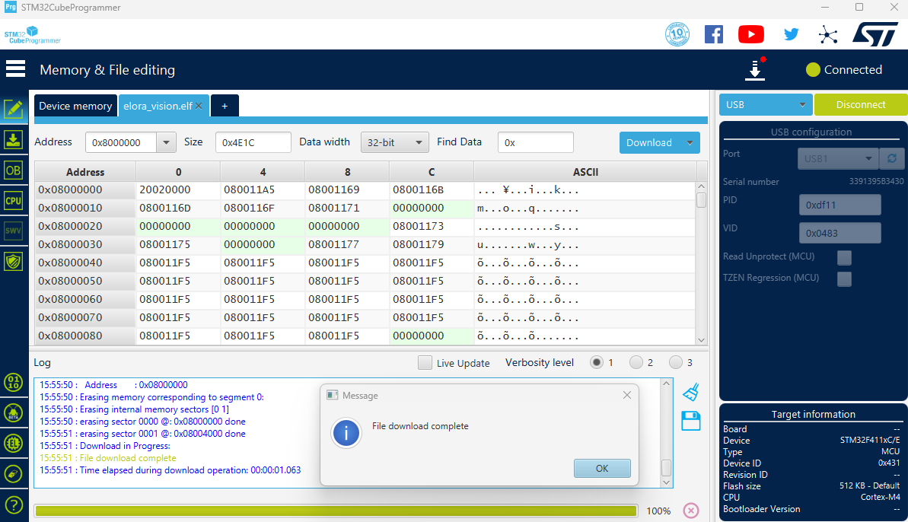

The PCB
==========

You need a PCB for each Sender Unit and Receiver Unit. You have two choice for the PCB.

- You can have the PCB manufactured and shipped to you by a PCB manufacturer.

- You can either build a PCB from some basic parts as explained in below.

Both methods are discussed in this page.

|
|
|

I want to order the PCB to be manufactured
-------------------------------------------------

The PCB is an open-hardware board designed by me for this project. The KiCad files and the BOM are available from `my GitHub repo <https://github.com/aminjahanpour/elora_vision_pcb>`_.

The PCB is a compact (4cm by 4cm) 4-layer board powered via its USB mini connection.
It has a LoRa chip and an energy-efficient STM32 chip on its board.
In total, 3 LEDs are included to provide a decent elaboration on both USB and Radio data
tx/rx processes and possible errors.
A 2-pin SW debug plug is provided for debugging and uploading the firmware.
To lower the final cost, I used JLCPCB basic parts (rather than extended parts) wherever I could.
The LCSC part numbers for the parts are included in the BOM.
Use these part numbers to look up the exact components on the JLCPCB website.

Gerber files are also included in the GitHub repo.

.. image:: ./images/pcb_pcb.jpg
    :align: center

|

**MCU**

The board is centered around an STM32F411CEU6 chip.
It is energy-efficient yet provides enough processing power for our Elora Vision firmware.

**LoRa**

I chose *RX1276* as for the LoRa module because this is perhaps the most common one in North America where I live.
The design targets 915 MHz abiding to the legal frequency bands in Canada.
I went with the IPEX antenna connection because it allows for more flexibility in antenna placement on the UAV.
The radio circuitry is based on the below sources:

- `Semtech reference design <https://www.semtech.com/products/wireless-rf/lora-connect/sx1276>`_

- `a design by Modtronix <https://modtronix.com/product/inair9b/>`_

Also check out `my question on StackExchange <https://electronics.stackexchange.com/questions/670470/circuitry-around-sma-for-a-lora-module-pcb-rx1276>`_ regarding the radio circuitry. The given answer is pretty informative.

.. note::
    Aside from the PCB itself, you need to separately buy `an antenna with IPEX connection <https://www.amazon.ca/dp/B0BY2CS5VB?psc=1&ref=ppx_yo2ov_dt_b_product_details>`_ for the LoRa radio.

|
|
|
I want to build my own PCB
-----------------------------

Here are the ingredients needed for one PCB.

1) one `BlackPill board <https://www.adafruit.com/product/4877>`_
    Or you can choose any other board centered around STM32F411CEU6. Pick a chip with at least 512 Kb flash just to make sure that the current firmware and also the possible future version will fit.
    If you want to use another chip, you still can use the `source code <https://github.com/aminjahanpour/elora_vision_firmware>`_ but you will have to compile/build the firmware from your own project files.
    I do not see why you'd want to choose another chip as STM32F411CEU6 is fast enough to get the job done and yet low on power.

2) one `Adafruit RFM95W LoRa Radio Transceiver Breakout <https://www.adafruit.com/product/3072>`_
    You need to check the regulations of your country for the permitted frequencies for hobby uses.
    If you live in north America, 915 MHz is within the legal range.

3) 8 jumper wires
    These wires are used to connect LoRa module to the board. Choose shorter cables to keep the PCB small and tidy.

4) A breadboard to host the board and the radio module if you wish.

As for the antenna, simply solder a wire of length 9.15 cm to the LoRa board.
Now all you have to do is the wiring as described in below.

=========   ========
Board Pin   LoRa Pin
=========   ========
3v3         VIN
G           GND
G0          A15
SCK         B12
MISO        B4
MOSI        B5
CS          B3
RST         B6
=====       =====

.. note::
    The firmware is designed to use SPI3 of the chip to communicate to the LoRa module.

You have a PCB now. It should look like this one below.

.. image:: ./images/black_pill_pcb.jpg
    :align: center

|

Next step is to flash the firmware to it.

|
|

How to flash the PCB Firmware
--------------------------------

Regardless of how you build a PCB, you need to flash the firmware to it.

I have developed a stable firmware that has gone through many tests and verifications.

Normally, you should never need to make changes to the firmware at any point.

But you do need to download the firmware and flash it to your PCB once.

Here is how you'd go about uploading the firmware to the PCB.

1) `Get STM32CubeProgrammer software from here <https://www.st.com/en/development-tools/stm32cubeprog.html>`_ and install it on your computer. You will use this application to flash the firmware into your PCB.

2) `Get the ELF file from here <https://github.com/aminjahanpour/elora_vision_firmware/releases/download/released/elora_vision.elf>`_ and store it on your computer.

Depending on your board, you are going to need either a regular USB cable or an `ST-Link <https://www.amazon.ca/dp/B07B2K6ZPK?psc=1&ref=ppx_yo2ov_dt_b_product_details>`_ programmer to connect the PCB to your computer.

If you are using a USB cable here are the steps you need to take to flash the firmware to your boards.

3) Connect the PCB to your computer via a USB cable.

On the PCB:

4) Hold-down the Boot key.

5) Press the Reset key once.

6) Let go of the Boot key.

On the STM32CubeProgrammer software:

7) Click on 'Open File` tab on the left and choose the ELF file.

8) Click on 'USB' on the right side and press `Connect`.

9) Finally click on `Download` button. After few seconds all is done and you have the firmware installed on the PCB.

|

Above shows a screenshot from a successful flash to the board. In the image you can see:

- elora_vision.elf file is properly opened by the program (shown in top left).

- USB connection is recognized by the the program (shown in top right).

- Flashing has been successful (confirmed by the info window shown by the program).

The PCB however, can only be programmed using the ST-Link (not by a USB cable). The board has the SWD pins which make it easy for you to flash the firmware into the chip.
You can still use STM32CubeProgrammer program but instead of a USB cable you need to use an `ST-Link <https://www.amazon.ca/dp/B07B2K6ZPK?psc=1&ref=ppx_yo2ov_dt_b_product_details>`_ device. The good thing about this method is that you will not need to do the hold-boot-then-press-reset dance anymore.
You can simply plug the linker, choose ST-Link on the program, press connect and download the firmware to PCB.

.. note::
    Same exact firmware is used on all PCBs (sender or receiver).

