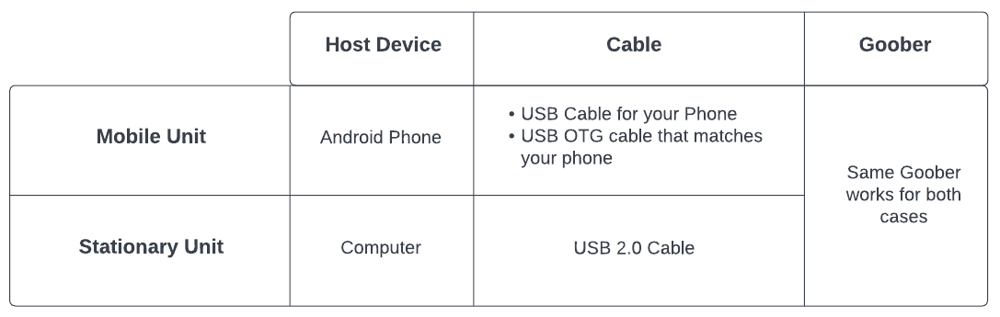

Quick Start
===========

Units
-----

What I call a Unit in here is a set simply made of below three items connected together.

1- A Host Device (This could be an Android phone or a computer)

2- USB cables

    - if you are using a computer as for the host device, you need a regular USB cable.
    - if you are using an Android phone, you need a both a regular USB cable and a USB OTG cable. A USB OTG cable turns your Android phone into a host device.

3- A PCB

Now that we know what I mean by a Unit, let's go ahead to define Sender Unit and Receiver Unit.

----

**Sender Unit**

A Sender Unit is the unit that takes the photo and records the GPS data.
If you are using your phone, the phone camera and GPS is used to generate the payload data.

The Sender Unit transmits the payload over the LoRa radio.

----

**Receiver Unit**

A Receiver Unit is the unit that receives and displays the payload information (image and GPS data).

.. note::
    Both Sender and Receiver Units can be either mobile or stationary. It is mobile unit if you are using you phone, and it
    it a stationary unit if you are using your computer.

In the figure below we can see two Sender Units (one is mobile and the other is stationary) are transmitting their payloads to a Receiver Unit.

.. image:: ./images/layout.png

Parts you need to have
----------------------

You could make a network of sender and receiver units.
The simplex network topography has one sender and one receiver unit. A unit can be a mobile or a stationary unit.
This image shows the parts used in each type of unit.

.. note::
    The same mobile or stationary unit can be used as a Sender Unit or a Receiver Unit. No change of software or hardware is needed. Role of a unit can be changed simply in the app.

----

**Mobile Unit**

It could be often the case that you'd want to use a mobile Sender Unit and an stationary receiver Unit.
This is when you use your Android phone to take photos and transmit them to your computer which in this case would be your stationary Receiver Unit.

A mobile Sender Unit normally uses a phone. In this case this phone does some heavy liftings such as taking photos and performing image processing. So use the better/newer phone for this sender role.
This is not the case for the android phone in the Receiver Unit. It can be an older device.

A common use case would be taking photoes with a drone. This mobile Sender Unit is attached to the drone frame for example.
However, it works completely separate from the drone itself. The PCB is powered by the phone battery via the USB cable (has nothing to do with the drone battery).
So everything works so long as the android phone battery is alive.
The camera of this phone needs to face toward the ground while the drone is flying.
Remember that LoRa radio module long range capability is actualized only on a direct line of sight.

----

**Stationary Unit**

You could use your computer as both a Sender Unit or a Receiver Unit. If you are using it as a Sender Unit, you'd need a webcam of course.
The you need to run on your computer is written in Python and runs on any operating system.

.. note::
    * The same PCB could be used in the Sender Unit or in the Receiver Unit.
    * The same android app (Elora Vision app) is installed on both Sender Unit and Receiver Unit phones.
    * One Sender Unit can feed image data to many Receiver Units so long as they all share the same encryption key.

Setting up everything for the first time
----------------------------------------

**Step 1- Setting up Elora Vision App**

You need to install the Elora Vision App on the host devices. It could be either your android phone or your computer.
This is the case for both Sender and Receiver Units. You need to do this step once but for every host device.

For your android phone, read :ref:`installphoneapp`,

and for your computer, read :ref:`installdesktopapp`.

Once you installed the app on both ends we are ready for the next step.

**Step 2- Create and share encryption keys**

Only the devices that share the same encryption key can understand each other payload. This is to make sure the image data and GPS info from your Sender Unit(s)
is useful only to your own Receiver Unit(s).

All the steps you need to take are explained in below link:

:ref:`synckeys`

Once you have created and shared a key in between all you host devices, you are ready for the next step.

Start broadcasting
------------------

After having everything set up, here are steps to actually starting broadcasting.

1- Make sure all the cables are connected as shown in figure above.

----

*Sender Unit*

2- Open the Elora Vision app on the android phone or your computer.

3- Tap on *Sender Unit*

4- Tap on *Sync with PCB*

5- Tap on *Start Camera*

That's it. You are done with the Sender Unit. The data are already being transmitted already.

----

*Receiver Unit*

6- Open the Elora Vision app on Android Phone #2 or your computer (Receiver Unit).

7- Tap on *Receiver Unit*

8 - Tap on *Sync with PCB*

9- Tap on *Play*

That's all. In a few seconds image frames start appearing on your screen.

